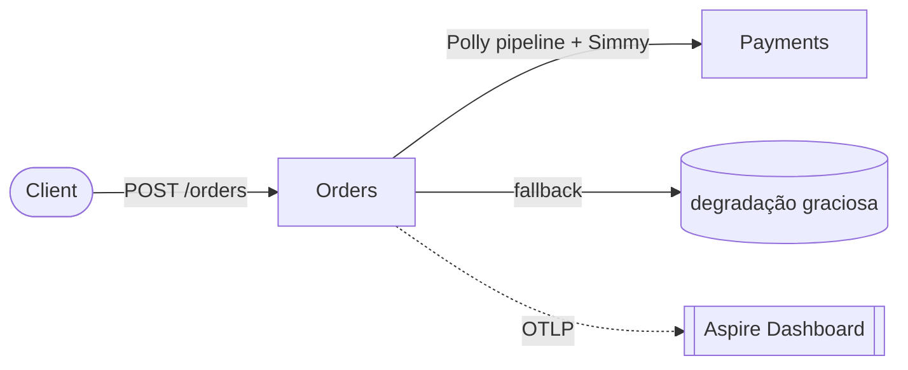

# resilience-and-chaos

> **Polly v8** (circuit breaker, bulkhead, rate limiter, timeout, retry) + **Simmy** (injeção de
> caos em runtime) + **fallback** (degradação graciosa), com um **experimento automatizado**
> provando que a **disponibilidade sobrevive ao caos** — tudo orquestrado pelo **.NET Aspire**.

[](https://github.com/thomasmoreira/resilience-and-chaos/actions/workflows/ci.yml)

---

## A tese

Os outros labs provam que você **constrói** sistemas distribuídos. Este prova que você os
**desenha para falhar bem** — a marca de um arquiteto.

> Funcionar no caminho feliz é fácil. **Sobreviver ao caos é engenharia.**

## Arquitetura



O **Orders** chama o **Payments** através de um **pipeline Polly**; o **Simmy** injeta caos em
runtime; quando o Payments cai, o **circuito abre** e o **fallback** assume — e um **experimento
automatizado** mede que a disponibilidade aguenta.

## Componentes

| Peça | Papel |
|---|---|
| **Orders** | Pipeline Polly v8 (bulkhead, retry, circuit breaker, timeout, fallback) + rate limiter inbound |
| **Payments** | Downstream simples — alvo do caos |
| **Simmy** | Injeção de latência/fault/outage por config, **togláveis ao vivo** (chaos as code) |
| **Experimento** | Teste que mede a **disponibilidade sob outage** — a prova automatizada do SLO |
| **OpenTelemetry** | Traces/métricas → **dashboard do Aspire** (o stack LGTM completo é o lab [observability-from-scratch](https://github.com/thomasmoreira/observability-from-scratch)) |

## O killer detail

Sob **outage total** do Payments, o `POST /orders` **ainda responde** — degradado
(`pending_payment`, não 5xx): o circuito abre, o fallback assume, e a **disponibilidade fica
≥ 99%**. E isso não é afirmação: é um **experimento automatizado** (`dotnet test`) com critério
de sucesso. Resiliência **medida**.

## Sinais de arquiteto

- **Cada estratégia Polly com propósito** — retry ≠ circuit breaker ≠ bulkhead ≠ rate limiter.
- **Saber quando NÃO usar** — sem *hedging* aqui: ele dispara chamadas paralelas, perigoso num
  `POST /payments` (risco de cobrança dupla). Hedging é para leituras idempotentes.
- **Chaos as code** — caos reproduzível e toglável, não falha manual.
- **Degradação graciosa** — falhar bem (fallback) em vez de falhar feio.
- **Resiliência medida** — o experimento tem critério de sucesso (disponibilidade ≥ 99% sob outage),
  como o SLO/error budget do lab de observabilidade.

## O pipeline (de fora para dentro)

```
rate limiter (inbound)  →  /orders  →  [ bulkhead → retry → circuit breaker → timeout → chaos ]  →  Payments
                                                                                                  fallback ⤴ (degrada)
```

Cada estratégia tem um papel: o **bulkhead** isola concorrência; o **retry** absorve falhas
transitórias; o **circuit breaker** abre rápido sob falha sustentada (fail-fast); o **timeout**
corta tentativas lentas; o **chaos** (Simmy) é injetado logo antes da chamada real; e o
**fallback** transforma a falha em degradação graciosa.

## Endpoints

| Endpoint | O quê |
|---|---|
| `POST /orders` | Cria um pedido chamando o Payments pelo pipeline resiliente |
| `POST /chaos` | Liga/desliga **fault e latência** em runtime: `{ "fault": true, "injectionRate": 1.0 }` |

## Como rodar + um experimento de caos

**Pré-requisitos:** .NET 10 SDK e Docker.

```bash
dotnet new install Aspire.ProjectTemplates   # uma vez
dotnet run --project src/AppHost             # Orders + Payments + dashboard

# 1) baseline: pedido confirma
curl -X POST http://localhost:<porta>/orders -H 'Content-Type: application/json' -d '{"amount":42}'
#   → {"status":"confirmed", ...}

# 2) injeta outage total do Payments
curl -X POST http://localhost:<porta>/chaos  -H 'Content-Type: application/json' -d '{"fault":true,"injectionRate":1.0}'

# 3) o pedido AINDA responde — degradado (o circuito abre, o fallback assume)
curl -X POST http://localhost:<porta>/orders -H 'Content-Type: application/json' -d '{"amount":42}'
#   → {"status":"pending_payment", "payment":null}   ← disponibilidade preservada

# 4) desliga o caos → volta a confirmar
curl -X POST http://localhost:<porta>/chaos  -H 'Content-Type: application/json' -d '{"fault":false}'
```

## Verificação ao vivo

```bash
dotnet test
```

- **Baseline + toggle de caos**: confirma → degrada sob caos → recupera.
- **Experimento (resiliência medida)**: sob **outage total** do Payments, a **disponibilidade do
  `/orders` fica ≥ 99%** (o fallback segura) — o caos é um experimento com critério de sucesso,
  não uma demo (ADR-005). Última execução: **disponibilidade 100%, todos degradados**.

> **Observabilidade:** o OpenTelemetry (via ServiceDefaults) exporta para o **dashboard do
> Aspire** — e para qualquer backend OTLP se `OTEL_EXPORTER_OTLP_ENDPOINT` estiver setado. O
> **stack LGTM completo + SLO/burn-rate** é o lab
> [observability-from-scratch](https://github.com/thomasmoreira/observability-from-scratch);
> aqui a prova do SLO é o **experimento automatizado** acima, não duplicada de propósito.

## Decisões de arquitetura

- [ADR-001 — Polly v8 resilience pipelines](docs/adr/ADR-001-polly-pipelines.md)
- [ADR-002 — Simmy (chaos as code)](docs/adr/ADR-002-simmy-chaos.md)
- [ADR-003 — Fallback para degradação graciosa](docs/adr/ADR-003-graceful-degradation.md)
- [ADR-004 — Bulkhead + rate limiter](docs/adr/ADR-004-bulkhead-ratelimiter.md)
- [ADR-005 — Resiliência medida (experimento como gate)](docs/adr/ADR-005-slo-gated.md)
- [ADR-006 — Observabilidade: OTel + dashboard do Aspire](docs/adr/ADR-006-grafana-lgtm.md)

---

_Lab de portfólio. Foco: Polly v8, Simmy chaos engineering, degradação graciosa, resiliência medida e .NET Aspire._
